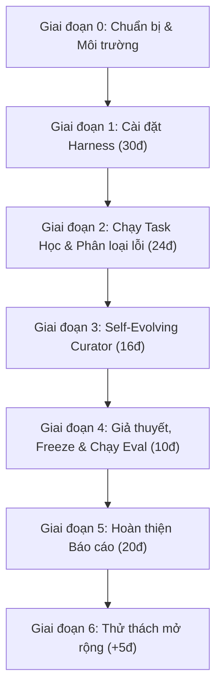

# CHECKLIST HOÀN THÀNH DỰ ÁN DAY 20: SELF-EVOLVING & MULTI-AGENTS
**Học phần:** Tác tử tự tiến hóa (Self-Evolving Agent) & Đa tác tử (Multi-Agent Harness)  
**Mục tiêu điểm số:** 100/100 điểm Rubric + 5 điểm thưởng  
**Thư mục làm việc:** `D:\AIVin\Day20\K4-DAY20-MULTIAGENTS-LucTienDat-2A202602969`

---

## 📌 TỔNG QUAN CÁC GIAI ĐOẠN



---

## 🚀 GIAI ĐOẠN 0: KHỞI TẠO & CẤU HÌNH MÔI TRƯỜNG

- [x] **0.1. Sao chép cấu hình môi trường `.env`**
  - Đã thực hiện `cp .env.example .env`.
  - [ ] Điền `LAB_MODEL` và API Key hợp lệ (mô hình bắt buộc hỗ trợ tool-calling).
- [x] **0.2. Khởi tạo tệp báo cáo**
  - Đã tạo `report/REPORT.md` từ `REPORT_TEMPLATE.md`.
- [x] **0.3. Kiểm thử môi trường ban đầu**
  - Chạy `pytest tests/test_01_provided.py` -> Đạt 15/15 tests.
- [ ] **0.4. Chạy script khảo sát công cụ & trả lời câu hỏi làm quen**
  - Chạy `python scripts/tour.py`.
  - Trả lời 3 câu hỏi vào Mục 3 của `report/REPORT.md`:
    - [ ] Công cụ mặc định gồm những gì? Công cụ nào chạy lệnh? (`execute`)
    - [ ] Mô tả của `task` nói gì về `general-purpose`? Ngữ cảnh truyền vào thế nào?
    - [ ] Trích 1 câu hướng dẫn hành vi từ mô tả công cụ `task` và 1 câu từ `execute`.

---

## 🛠️ GIAI ĐOẠN 1: CÀI ĐẶT AGENT HARNESS (30 ĐIỂM)

- [x] **1.1. Cài đặt `src/lab/subagents.py` (Hướng dẫn: `02_subagents.md`)**
  - [x] Cài đặt hàm `get_subagents() -> list[dict]`.
  - [x] Định nghĩa ít nhất 2 subagent với vai trò rõ ràng (ví dụ: `explorer`, `implementer`, `reviewer`).
  - [x] Mỗi subagent có đầy đủ `name`, `description` (chỉ dẫn hành động rõ ràng khi nào gọi), `system_prompt`.
  - [x] Kiểm tra unit test:
    ```bash
    pytest tests/test_02_agent.py -k test_subagents_have_required_fields
    ```

- [x] **1.2. Cài đặt `src/lab/agent.py` (10 điểm - Hướng dẫn: `01_agent.md`)**
  - [x] Cài đặt `make_backend(sandbox)`:
    - `root_dir = sandbox`, `virtual_mode = True`, `inherit_env = False`.
    - Thiết lập `PATH` chứa thư mục python hiện tại và các đường dẫn cơ bản.
    - Đảm bảo **không làm lộ** API Key vào môi trường shell của tác tử.
  - [x] Cài đặt `build_agent(sandbox, mode="single", use_skills=False, model=None)`:
    - Kiểm tra `mode` hợp lệ (`"single"` hoặc `"subagents"`), ném `ValueError` nếu sai.
    - Xử lý `mode == "subagents"`: Nối `PATHS_NOTE` vào từng subagent và thêm `SUBAGENTS_NOTE` vào prompt chính.
    - Xử lý `use_skills=True`: Nạp `skills=["/skills/"]` và thêm `SKILLS_NOTE` vào prompt.
    - Gọi `create_deep_agent(...)`.
  - [x] Kiểm tra unit test:
    ```bash
    pytest tests/test_02_agent.py
    ```
    *(Kết quả: Đạt 9/9 tests passed - 10/10 điểm)*

- [x] **1.3. Cài đặt `src/lab/runner.py` (12 điểm - Hướng dẫn: `03_runner.md`)**
  - [x] Cài đặt hàm `run_task(...)`:
    - Chuẩn bị sandbox tạm thời ngoài kho (`tempfile.mkdtemp`).
    - Tính và lưu `skills_sha256 = hash_dir(sandbox/"skills")`.
    - Đo token bằng `UsageMetadataCallbackHandler`.
    - Bắt ngoại lệ để tác tử không bị dừng giữa chừng (ghi vào `record["error"]`).
    - Đếm chính xác: `tool_calls`, `subagent_calls` (tên `"task"`), `skills_read` (các thư mục skill khác nhau dưới `"skills/"`).
    - Kiểm tra `skills_modified` (so sánh hash trước và sau khi chạy).
    - Chấm điểm bằng `grade(task, sandbox/"workspace")`.
    - Ghi `trace.md` và `run.json`. Dọn dẹp thư mục sandbox sau khi hoàn thành.
  - [x] Kiểm tra unit test:
    ```bash
    pytest tests/test_03_runner.py
    ```
    *(Kết quả: Đạt 6/6 tests passed - 12/12 điểm)*

- [ ] **1.4. Chạy kiểm thử tích hợp 1 task thực tế**
  - Chạy thử task `data-learn` điều kiện `baseline`:
    ```bash
    python -m lab.runner --condition baseline --tasks data-learn
    ```
  - Kiểm tra có kết quả tại `results/baseline/data-learn/run.json` và `trace.md`.

---

## 📊 GIAI ĐOẠN 2: CHẠY TÁC VỤ HỌC & PHÂN LOẠI LỖI (24 ĐIỂM)

- [ ] **2.1. Chạy Baseline & Subagents trên các tác vụ học (7 điểm)**
  - [ ] Chạy các tác vụ học còn lại cho `baseline`:
    ```bash
    python -m lab.runner --condition baseline --tasks code-learn logs-learn
    ```
  - [ ] Chạy điều kiện `subagents` trên toàn bộ tác vụ học:
    ```bash
    python -m lab.runner --condition subagents --tasks learn
    ```
  - [ ] Đảm bảo thư mục `results/baseline/` và `results/subagents/` có đầy đủ 3 tác vụ học.

- [ ] **2.2. Bảng phân loại lỗi (Error Taxonomy - 10 điểm)**
  - [ ] Mở `run.json` và `trace.md` của 3 tác vụ học (`code-learn`, `data-learn`, `logs-learn`).
  - [ ] Phân loại ít nhất **4 check thất bại** vào các nhóm từ A đến G:
    - Nhóm A: Bỏ qua đặc tả
    - Nhóm B: Không kiểm chứng
    - Nhóm C: Vá triệu chứng
    - Nhóm D: Bỏ sót dữ liệu bẩn / định dạng
    - Nhóm E: Vi phạm quy ước tổ chức (tiền tố `rule_`, `RULE:`)
    - Nhóm F: Báo cáo hoàn thành sai sự thật
    - Nhóm G: Khác
  - [ ] Điền bảng phân loại lỗi vào Mục 4 của `report/REPORT.md` với đầy đủ bằng chứng trích dẫn cụ thể.
  - [ ] Đưa ra bằng chứng phủ định từ `python scripts/check_breakdown.py` (số check kỹ thuật đạt/tổng).

- [ ] **2.3. Quan sát và phân tích điều kiện `subagents` (7 điểm)**
  - Điền Mục 5 của `report/REPORT.md`:
    - [ ] Nêu rõ tên, vai trò, lý do thiết kế các subagent.
    - [ ] Phân tích trường `subagent_calls` (có giao việc không, nếu 0 thì giải thích vì sao).
    - [ ] Đánh giá thông tin giao việc và báo cáo phản hồi.
    - [ ] So sánh lượng token tiêu thụ và thời gian thực thi so với `baseline`.

---

## 🧬 GIAI ĐOẠN 3: SELF-EVOLVING - SKILL DO CURATOR SINH (16 ĐIỂM)

- [x] **3.1. Cài đặt `src/lab/curator.py` (8 điểm trong test - Hướng dẫn: `04_curator.md`)**
  - [x] Cài đặt hàm `curate_skills(...)`:
    - Đọc các file `run.json` và `trace.md` của các tác vụ học (`role == "learn"`).
    - Tuyệt đối **không đọc** tác vụ đánh giá (`role == "eval"`).
    - Lấy tên và `detail` của các check có `passed == False`.
    - Nếu không có check nào thất bại -> in cảnh báo và trả về danh sách rỗng (không gọi LLM).
    - Tạo prompt yêu cầu LLM viết tối đa `max_skills` quy trình phòng ngừa lỗi tổng quát.
    - Tách khối qua `parse_skill_blocks` và kiểm tra qua `validate_skill`.
    - Ghi skill hợp lệ vào `skills/auto/<name>/SKILL.md`.
  - [x] Kiểm tra unit test:
    ```bash
    pytest tests/test_04_curator.py
    ```
    *(Kết quả: Đạt 2/2 tests passed - 8/8 điểm)*

- [ ] **3.2. Chạy Curator sinh skill tự động (5 điểm)**
  - [ ] Chạy lệnh:
    ```bash
    python -m lab.curator
    ```
  - [ ] Xác nhận trong `skills/auto/` có ít nhất 1 skill hợp lệ được sinh ra (không sửa tay).

- [ ] **3.3. Đánh giá chất lượng skill (5 điểm)**
  - Điền Mục 6 của `report/REPORT.md`:
    - [ ] Phân tích tính tổng quát hay cục bộ của từng skill.
    - [ ] Đánh giá tính đúng đắn (có hướng dẫn sai hoặc gây hại không).
    - [ ] Đo số dòng, kiểm tra tính phù hợp của `description` và điều kiện kích hoạt.
    - [ ] Ghi lại số lần chạy curator hoặc lý do xóa skill (nếu có).

- [ ] **3.4. Kiểm tra skill trên tác vụ học (Môi trường Dev)**
  - [ ] Chạy thử nghiệm:
    ```bash
    python -m lab.runner --condition skills-auto --tasks learn
    ```
  - [ ] Kiểm tra `skills_read` và đối chiếu `trace.md`.
  - [ ] **Sao lưu kết quả học trước khi freeze:**
    ```bash
    cp -r results/skills-auto results/skills-auto-dev
    ```

---

## 🔒 GIAI ĐOẠN 4: GIẢ THUYẾT, ĐÓNG BĂNG & CHẠY EVAL (10 ĐIỂM)

- [ ] **4.0. Viết giả thuyết (4 điểm trong báo cáo - TRƯỚC KHI FREEZE)**
  - Điền Mục 2 của `report/REPORT.md` với cả 3 giả thuyết:
    - [ ] `H1` (subagents so với baseline): Dự đoán điểm và chi phí token.
    - [ ] `H2` (skills-auto so với baseline): Dự đoán khả năng tổng quát hóa trên eval.
    - [ ] `H3` (tác vụ học so với tác vụ đánh giá): Dự đoán hiện tượng overfitting / drop score.
  - Commit giả thuyết:
    ```bash
    git add -A && git commit -m "hypotheses"
    ```

- [ ] **4.1. Đóng băng Skill (Freeze Tag)**
  - Tạo tag `freeze` ngay sau commit giả thuyết:
    ```bash
    git add -A && git commit --allow-empty -m "freeze skills" && git tag freeze
    ```

- [ ] **4.2. Chạy chính thức trên toàn bộ tác vụ (Official Evaluation Runs - 3 điểm)**
  - [ ] Chạy baseline trên tác vụ đánh giá:
    ```bash
    python -m lab.runner --condition baseline --tasks eval
    ```
  - [ ] Chạy subagents trên tác vụ đánh giá:
    ```bash
    python -m lab.runner --condition subagents --tasks eval
    ```
  - [ ] Chạy skills-auto trên **tất cả** 6 tác vụ:
    ```bash
    python -m lab.runner --condition skills-auto --tasks all
    ```
  - [ ] **Kiểm tra giao thức đóng băng (5 điểm):**
    ```bash
    python scripts/verify_freeze.py
    ```
    *(Mục tiêu: Báo `OK`, không có lỗi nào)*

- [ ] **4.3. Tạo bảng so sánh tổng hợp (5 điểm)**
  - [ ] Xuất bảng so sánh tự động:
    ```bash
    python -m lab.compare > report/table.md
    ```
  - [ ] Dán nội dung `report/table.md` vào Mục 7 của `report/REPORT.md`.

- [ ] **4.4. Thống kê bóc tách kỹ thuật vs quy ước**
  - Chạy `python scripts/check_breakdown.py` và lưu số liệu vào Mục 7 của báo cáo.

---

## 📝 GIAI ĐOẠN 5: HOÀN THIỆN BÁO CÁO REPORT.MD (20 ĐIỂM)

- [ ] **5.1. Mục 1: Thông tin cấu hình đầy đủ**
  - Điền tên thành viên, MSSV, mô hình `LAB_MODEL`, phiên bản `deepagents`, hệ điều hành.
- [ ] **5.2. Mục 8: Phân tích sâu số liệu (8 điểm)**
  - [ ] Câu 1: So sánh điểm học vs đánh giá giữa 3 điều kiện; phân tích dấu hiệu quá khớp (overfitting).
  - [ ] Câu 2: Tách điểm kỹ thuật và quy ước (`rule_`). Phân tích xem skill hỗ trợ nhóm nào tốt hơn.
  - [ ] Câu 3: Trích dẫn vết cụ thể cho 1 check skill giúp đạt và 1 check skill không giúp.
  - [ ] Câu 4: Phân tích chi phí token và hiệu quả chi phí (score per token). Đa tác tử có bõ công không?
  - [ ] Câu 5: Bằng chứng về việc không rò rỉ dữ liệu (data leakage) hoặc quá khớp skill.
  - [ ] Câu 6: Đo nhiễu: so sánh kết quả tác vụ học ở Phần 3.4 (`skills-auto-dev`) và sau khi freeze.
- [ ] **5.3. Mục 9: Hạn chế và tính hợp lệ (4 điểm)**
  - Nêu ít nhất 3 hạn chế (tập task nhỏ, chạy 1 lần, độ lệch ngẫu nhiên của LLM, quy ước bài tập, 1 loại model).
- [ ] **5.4. Mục 10 & Phụ lục: Kết luận & Nhật ký lệnh chạy (4 điểm)**
  - Kết luận súc tích (dưới 5 câu) bám sát dữ liệu thực nghiệm.
  - Liệt kê toàn bộ các lệnh đã chạy theo thứ tự tái lập.

---

## 🌟 GIAI ĐOẠN 6: THỬ THÁCH MỞ RỘNG (TÙY CHỌN: TỐI ĐA +5 ĐIỂM)

Chọn 1 trong các hướng sau và trình bày vào phần Phụ lục của báo cáo:
- [ ] **Hướng 6a: Tiến hóa tại thời điểm chạy (Hot-path evolution)**
- [ ] **Hướng 6b: Vòng tiến hóa thứ hai (Second-round curator)**
- [ ] **Hướng 6c: Tấn công curator (Red team curator / prompt injection)**
- [ ] **Hướng 6d: Subagent nạp skill (`"skills": ["/skills/"]`)**
- [ ] **Hướng 6e: Đo độ nhiễu lặp lại (Chạy eval thêm ít nhất 2 lần và tính độ lệch)**

---

## ⚠️ CÁC NGUYÊN TẮC CẦN TRÁNH ĐỂ KHÔNG BỊ TRỪ ĐIỂM

| Vi phạm | Mức phạt | Lưu ý phòng tránh |
|---|---|---|
| Lộ API Key trong code, trace hoặc báo cáo | **-10 điểm** | Không in biến môi trường, kiểm tra kỹ trước khi commit |
| Sửa tay nội dung `skills/auto/` hoặc chép đáp án eval | **-10 điểm** | Để curator tự viết 100%, không mở `eval` trước freeze |
| Sửa các tệp có sẵn hoặc sửa `tests/`, `tasks/` | **-10 điểm** | Chỉ code trong các hàm TODO của 4 file được chỉ định |
| Sửa `skills/` sau tag `freeze` | **-10 điểm** | Giữ nguyên sau tag `freeze` |
| Báo cáo số liệu sai lệch so với thư mục `results/` | **-5 đến -10 điểm** | Sử dụng trực tiếp output từ `lab.compare` |

---

## 🧪 BỘ LỆNH KIỂM TRA NHANH TOÀN DIỆN (PRE-SUBMISSION CHECK)

```bash
# 1. Chạy toàn bộ unit test (phải pass 100%)
pytest

# 2. Kiểm tra quy trình đóng băng freeze
python scripts/verify_freeze.py

# 3. Tạo lại bảng đối chiếu
python -m lab.compare

# 4. Kiểm tra thống kê bóc tách
python scripts/check_breakdown.py
```
